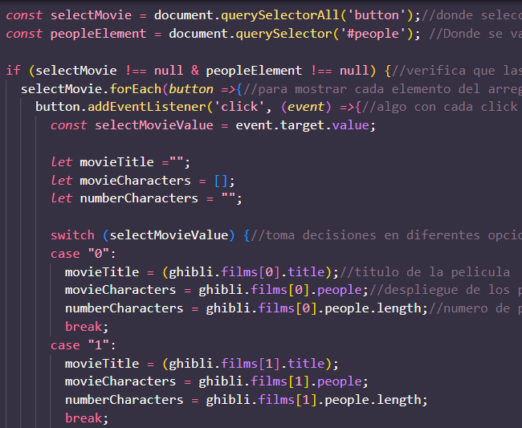
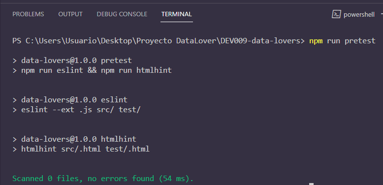
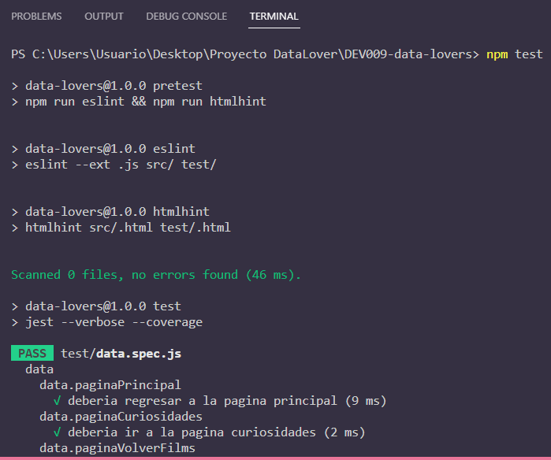
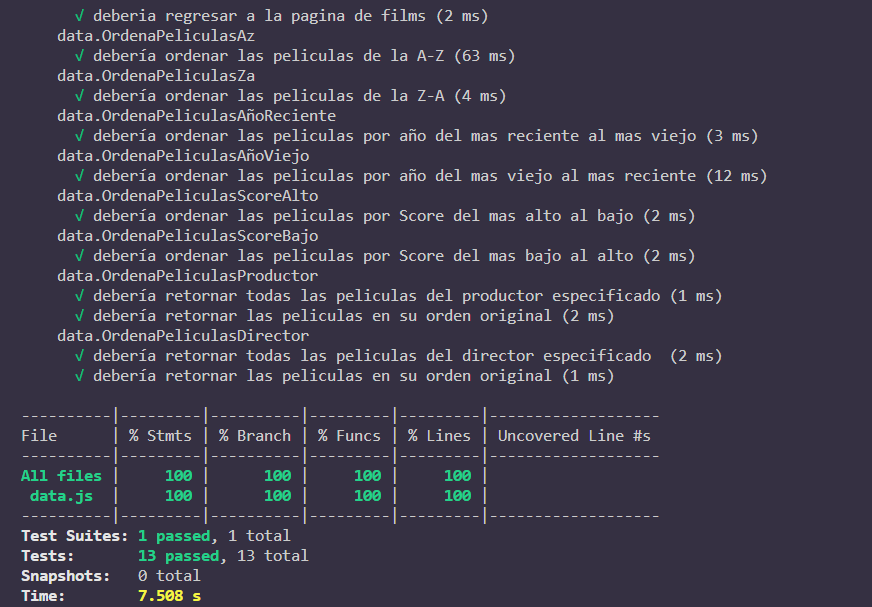

# Data Lovers

## Índice

* [1. Consideraciones generales](#1-consideraciones-generales)  
* [2. Definicion del proyecto](#2-Definicion)
* [3. Funcionalidades](#3-funcionalidades)
* [4. Boilerplate](#4-Boilerplate)
* [5. Estructura del Proyecto](#5-Estructura-del-Proyecto)
* [6. Pruebas](#6-pruebas)
* [7. Visita nuestro sitio web](#7-Visitweb)
* [8. Agradecimientos](#8-Agradecimientos)
***

## 1. Consideraciones generales

* Este proyecto se resolvio en duplas.
* El rango de tiempo estimado para completar el proyecto fue de 3 a 4 Sprints.
* El proyecto fue entregado subiendo nuestro código a GitHub (commit/push) y la
  interfaz fue desplegada usando [GitHub Pages](https://pages.github.com/).

## 2. Definición del proyecto

En nuestro proyecto se **construyo una _página web_ para visualizar un
_conjunto (set) de datos_** con tematica de Studio Ghibli, nos presenta una pagina principal
con con 2 botones que nos dirigen a films y personajes, en films podemos visualizar los poster
de las peliculas, y podemos filtrar y ordenar la data en diferente orden, por productor y director, ademas un calculo agregado para saber cuantos personajes son en total por pelicula y un espacio adicional con algunas curiosidades de algunas peliculas de studio ghibli.

* Prototipo de baja fidelidad


* Prototipos de alta fidelidad

[prototipo cel] (https://www.figma.com/proto/VqlwWW0hBw4QZOF9RtzH5E/Studio-Ghibli?page-id=0%3A1&type=design&node-id=6-109&viewport=351%2C433%2C0.5&scaling=scale-down&starting-point-node-id=1%3A13)

[prototipo pc] (https://www.figma.com/proto/9LrVbpGSelbKIuHVXbH8Ix/Untitled?type=design&node-id=1-2&scaling=scale-down&page-id=0%3A1&starting-point-node-id=1%3A2)

### Test de usabilidad

Incluimos un testeo de usabilidad con el prototipo de alta fidelidad elaborado en figma, para que los usuarios pudieran interactuar con el prototipo.


Se incluye lista de problemas detectados en el test de usabilidad:


#### Diseño de experiencia de usuario 

* Investigación con usuarios 

* ¿Quiénes son los principales usuarios de producto?

Los usuarios que son fanaticos de studio ghibli y les interesa explorar sitios con información de las peliculas.

* ¿Cuáles son los objetivos de estos usuarios en relación con el producto?

Poder interactuar de una forma fácil con el sitio web y tener información que sea de su agrado.

* ¿Cuáles son los datos más relevantes que quieren ver en la interfaz y por qué?

Studio Ghibli tiene varias animaciones, para nuestras usuarias es importante saber cuántas y cuáles son.
En Studio Ghibli hay directores y productores que han colaborado en la creación de más de una animación. Por ello, es importante para nuestras usuarias poder conocerlos y saber cuántas y cuáles son las animaciones a las que dieron "vida".
Las animaciones tienen información relevante para nuestras usuarias, como descripción, fecha de lanzamiento, peso, director, productor y personajes.
Cada animación tiene sus personajes, para nuestras usuarias es importante saber cuántos y cuáles son.

* ¿Cuándo utilizan o utilizarían el producto?

Cada que las usuarias quieran entrar al sitio web y pasar un momento divertido y entretenido con información releevante para ellas como fanaticas de studio ghibli.

### Organización del Trabajo

### Historias de Usuario

* 
* 
* 
* 
* 
* 
* 
* 
* 
* 
* 


## 3. Funcionalidades

Nuestro proyecto presenta una pagina web con tematica de studio ghibli.

El listado de funcionalidades es el siguiente:

1. El sitio web se presenta con una página principal, que tiene 2 botones de acceso a films y personajes.


para lo cual se uso el siguiente codigo:


2. Despues presentamos la página de films.


3. La página films tiene filtros para que el usuario pueda interactuar con la página como mejor le parezca, esta la parte de ordenar por, para la cual se utilizo el siguiente código para su funcionalidad en js:


4. La página films también tiene la opción de ordenar por productor, se uso el siguiente código en js para dar funcionalidad:


5. La página films también tiene la opción de ordenar por director, se uso el siguiente código en js para dar funcionalidad:


6. La página films también tiene un botón de acceso a curiosidades estudio ghibli.


7. La página films tiene un botón para volver a la página principal, la página de films a su vez tiene un botón de acceso a la página de curiosidades y la página de curiosidades tiene un botón de regreso a films, se muestra el código en js para dar funcionalidad a estos botones:


8. Despues tenemos la pagina de personajes.


9. La página de personajes tiene un botón de regreso a la página principal y otros botones con titulos de peliculas a los cuales se les dio funcionalidad con el siguiente código:





## 4. Boilerplate

La lógica del proyecto fue implementada completamente en JavaScript
(ES6), HTML y CSS. 

El _boilerplate_ contiene una estructura de archivos como punto de partida así
como toda la configuración de dependencias:

```text

├── EXTRA.md
├── README.md
├── package.json
├── src
|  ├── data (studio ghibli)
|  |  ├
|  |  └── ghibli
|  |  |  ├── ghibli.js
|  |  |  ├── ghibli.json
|  |  |  └── README.md
|  ├── data.js
|  ├── index.html
|  ├── main.js
|  └── style.css
└── test
└── data.spec.js
```

## 5. Estructura del Proyecto


### HTML

- [ ] **Uso de HTML semántico**


### CSS

- [ ] **Uso de selectores de CSS**

- [ ] **Modelo de caja (box model): borde, margen, padding**

- [ ] **Uso de flexbox en CSS**

### Web APIs

- [ ] **Uso de selectores del DOM**

- [ ] **Manejo de eventos del DOM (listeners, propagación, delegación)**

- [ ] **Manipulación dinámica del DOM**


### JavaScript

- [ ] **Diferenciar entre tipos de datos primitivos y no primitivos**

- [ ] **Arrays (arreglos)**

- [ ] **Objetos (key, value)**

- [ ] **Variables (declaración, asignación, ámbito)**

- [ ] **Uso de condicionales (if-else, switch, operador ternario, lógica booleana)**

- [ ] **Uso de bucles/ciclos (while, for, for..of)**

- [ ] **Funciones (params, args, return)**

- [ ] **Pruebas unitarias (unit tests)**


### Control de Versiones (Git y GitHub)

- [ ] **Git: Instalación y configuración**

- [ ] **Git: Control de versiones con git (init, clone, add, commit, status, push, pull, remote)**

- [ ] **Git: Integración de cambios entre ramas (branch, checkout, fetch, merge, reset, rebase, tag)**

- [ ] **GitHub: Creación de cuenta y repos, configuración de llaves SSH**

- [ ] **GitHub: Despliegue con GitHub Pages**


### Herramientas

* [Git](https://git-scm.com/)
* [GitHub](https://github.com/)
* [GitHub Pages](https://pages.github.com/)
* [Node.js](https://nodejs.org/)
* [Jest](https://jestjs.io/)


## 6. Pruebas

Se incluyen pruebas con el uso de jest test.

* npm run pretest


 

* npm test





## 7. Visita nuestro sitio web


## 8. Agradecimientos


